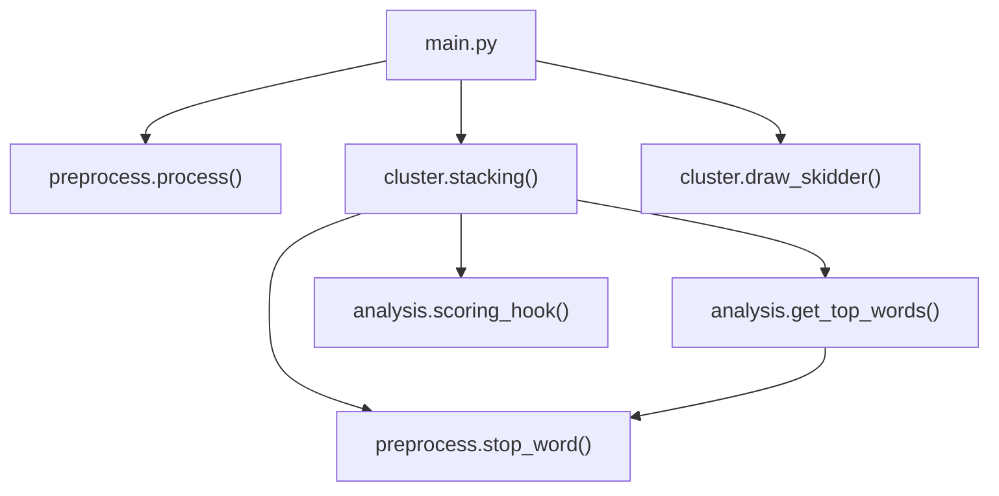
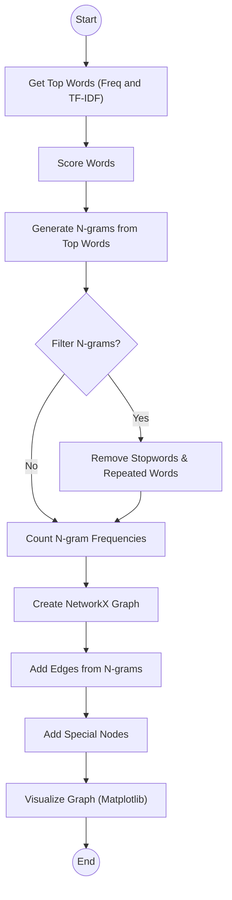
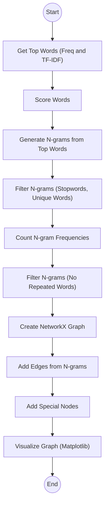
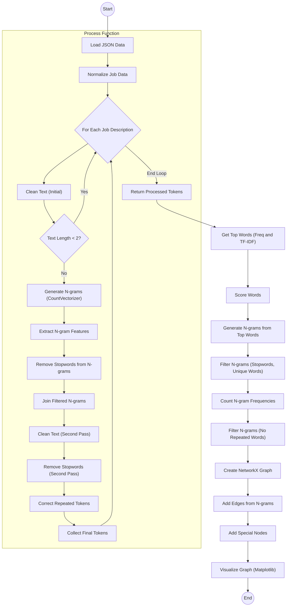

# Phân tích dữ liệu tuyển dụng (Job Data Analysis)
## Mô tả dự án

Dự án này nhằm phân tích dữ liệu tuyển dụng từ các file JSON, xử lý văn bản mô tả công việc, trích xuất các từ khóa quan trọng, tạo n-grams, và trực quan hóa mối quan hệ giữa các từ khóa bằng đồ thị NetworkX.

### Các bước chính bao gồm:

**Tiền xử lý dữ liệu**: loại bỏ **stopwords**, chuẩn hóa văn bản, tách token.

Lấy các **từ khóa quan trọng** dựa trên **tần suất (Frequency)** và **TF-IDF**.

Tạo **n-grams** từ các từ khóa và lọc các **n-grams** không cần thiết.

Xây dựng đồ thị **NetworkX** từ n-grams và trực quan hóa bằng **Matplotlib**.

#### Cấu trúc thư mục
```
project/
│
├─ main.py                  # File chính để chạy toàn bộ quy trình
├─ Module/
│   ├─ __init__.py
│   ├─ analysis.py.py       # Hàm scoring
│   ├─ preprocess.py          # Hàm tiền xử lí
│   └─ cluster.py.py       # Hàm vẽ đồ thị cluster
└─ Data/
    └─ output.json                # Dữ liệu tuyển dụng
```
## Hướng dẫn sử dụng

### Cài đặt các thư viện cần thiết:
```
pip install -r requirements.txt
```

### Chạy chương trình:
```
python main.py
```

### Kết quả:

Danh sách các từ khóa quan trọng dựa trên tần suất và TF-IDF.

Đồ thị trực quan hóa mối quan hệ giữa các từ khóa.

## Flowchart
### main.py

### main.py


### cluster.py


### preprocess.py



# https://github.com/ArufaNguyen/Job-Analysis-test
### Assigment E-learning Finaly Áp dụng các kỹ thuật xử lý NLP, trực quan hoá dữ liệu. Tìm ra xu hướng nghành nghề CNTT, data. Làm việc theo nhóm.
## UTH 012012410014 - Ngôn ngữ python - Nhóm 9